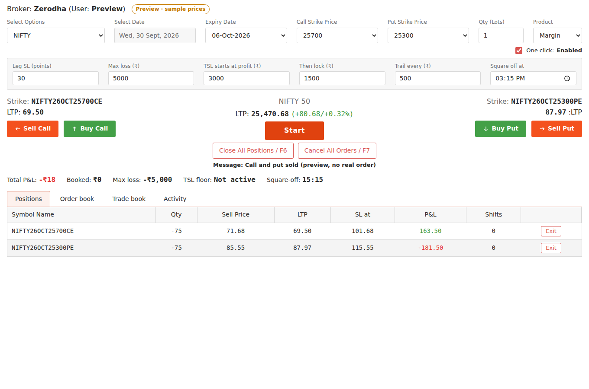

# One-click Option Seller

A single web page for selling NIFTY and SENSEX options through Zerodha, with the app watching your stop losses for you. It runs on your own computer.



## What it does

- **Start:** sells the selected call and put strikes together with your qty, at market.
- **Sell Call / Sell Put:** one click sells the chosen strike at market (qty in lots, Margin or Intraday product).
- **Buy Call / Buy Put:** buys back all your open short calls or puts.
- **Close All Positions (F6)** and **Cancel All Orders (F7)**.
- **Leg SL (points):** each leg exits when its premium rises that many points above the sell price. The app then sells the same type **4 strikes further away** with the same quantity and a fresh SL. This repeats every time a leg hits its SL.
- **Max loss (₹):** when total P&L (booked + open) reaches −max loss, everything is closed.
- **Trailing stop on profit:** once profit reaches *TSL starts at*, the app locks *Then lock*; for every further *Trail every* of profit the lock rises by the same amount. If profit falls back to the lock, everything is closed.
- **Square off at:** everything is closed at this time (default 3:15 PM).
- **One click** checkbox: untick it to get a confirmation before each order.

All orders are real MARKET orders. There is no paper mode.

**The app must stay running while you have positions.** If you close it or your computer sleeps, nothing watches your SL. The trade state is saved to `trade_state.json`, so when you start the app again it carries on monitoring.

## Setup (once)

1. Install Python 3.11+.
2. In the [Kite developer console](https://developers.kite.trade), set your app's **Redirect URL** to `http://localhost:8000/auth/callback`.
3. In this folder:

   ```bash
   python -m venv .venv
   source .venv/bin/activate        # Windows: .venv\Scripts\activate
   pip install -r requirements.txt
   cp .env.example .env             # then put your KITE_API_KEY and KITE_API_SECRET in .env
   ```

## Every trading day

```bash
source .venv/bin/activate
uvicorn app.main:app --port 8000
```

Open http://localhost:8000 and click **Log in with Kite** (Kite tokens expire every morning).

If you open `app/static/index.html` directly without the app running, it shows a preview with sample prices and never places orders.

## Tests

```bash
pip install -r requirements-dev.txt
pytest
```

The tests run the SL shift, max loss, TSL, square-off and order-retry rules against a simulated broker.
