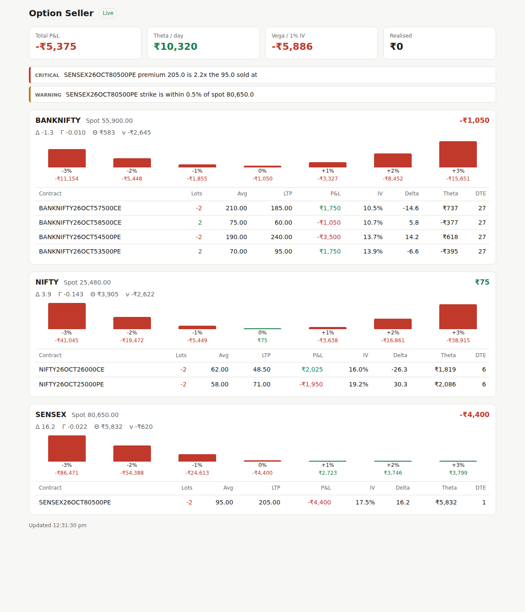

# Option Seller

A web app for option sellers on NSE and BSE F&O, using Zerodha Kite Connect.

**Phase 1 (this version):** live positions and risk. It pulls your open F&O positions from Kite, computes IV and Greeks for every leg, groups them by underlying (NIFTY, BANKNIFTY, SENSEX, BANKEX, stocks…), shows P&L if spot moves ±1–3%, and raises alerts when:

- total or per-underlying loss crosses a limit
- an underlying's net delta drifts past a limit
- a short strike is breached, or spot comes within a buffer of it
- a short option's premium reaches 2× the price it was sold at
- a short leg expires today

The app is read-only: it never places orders.



## Run it

Backend (Python 3.11+):

```bash
cd backend
python -m venv .venv && source .venv/bin/activate
pip install -r requirements-dev.txt
cp .env.example .env          # add your Kite API key and secret, or set DEMO_MODE=true
uvicorn app.main:app --reload --port 8000
```

Frontend (Node 22):

```bash
cd frontend
npm install
npm run dev                   # http://localhost:3000
```

With real keys, click **Log in with Kite**. Kite access tokens expire every morning, so you log in once per trading day.

Tests: `cd backend && pytest`.

## Layout

```
backend/app/
  broker.py      Kite login and data (plus DemoBroker sample positions)
  greeks.py      Black-Scholes price, Greeks, implied volatility
  portfolio.py   positions -> legs with Greeks, grouped by underlying, scenarios
  risk.py        risk rules -> alerts
  main.py        REST + WebSocket API (/api/portfolio, /ws/portfolio)
frontend/app/    Next.js dashboard
```

## Roadmap

- Phase 2: option chain and selling screener (delta, premium, IV rank, liquidity filters), payoff charts, margin estimates.
- Phase 3: trade journal, analytics, optional order placement with confirmation.
